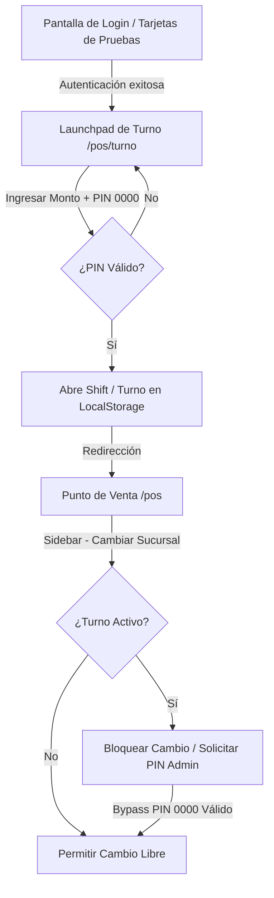

# Especificación de Diseño: Seguridad de Sucursales, Gestión de Cajas y Playground de Perfiles en PoShop V2

## 1. Objetivo General

Garantizar la integridad de las transacciones comerciales, la consistencia del libro contable y la facilidad en la fase de pruebas de desarrollo mediante un flujo combinado de **Portal de Lanzamiento (Launchpad)** y **Playground de Roles en Caliente**. 

Este sistema resuelve de manera definitiva:
1.  **Debilidades de Sucursales:** Restringe el cambio de sucursal para cajeros mediante un bloqueo estricto por turno abierto (`Shift`), permitiendo únicamente un bypass administrativo mediante el PIN `0000` de pruebas.
2.  **Pruebas de Roles Ineficientes:** Introduce un panel de simulación en caliente ("Playground Drawer") y tarjetas de acceso directo en el Login para alternar ágilmente entre los 5 perfiles del sistema (*Dueño, Admin, Cajero, Cobranza, Invitado*), con un blindaje dinámico que expulsa o bloquea pantallas en tiempo real si el nuevo rol carece de privilegios.
3.  **Contraste y Estética de Componentes:** Realiza un barrido visual completo de inputs, checkboxes y botones oscuros sin contraste, reemplazándolos con componentes impecables de alta visibilidad basados en los colores de la marca: **Azul Eléctrico (`#0066FF`)** y **Naranja Eléctrico (`#FF5500`)** sobre fondo de luz neutro (`bg-slate-50`).

---

## 2. Arquitectura de Acceso y Portal de Lanzamiento (Launchpad)

### A. Rediseño del Portal de Inicio de Sesión (`/login`)
La pantalla de acceso contará con dos pilares de usabilidad:
1.  **Formulario Estándar de Producción:** Correo y contraseña con inputs de texto con bordes claros y excelente contraste.
2.  **Contenedor de Pruebas (Quick Login):** Un panel inferior con fondo `bg-slate-50` y borde redondeado que presenta 5 tarjetas de usuario premium con iniciales del avatar, nombre completo y etiqueta de rol:
    -   `Ana González` &middot; **CAJERO (Caja)**
    -   `Carlos Moreno` &middot; **ADMINISTRADOR (Técnico)**
    -   `Roberto Díaz` &middot; **PROPIETARIO (Full)**
    -   `Sofía Martínez` &middot; **COBRANZA (Clientes/Créditos)**
    -   `Auditor Externo` &middot; **INVITADO (Solo lectura)**
    Hacer clic en cualquier tarjeta inyectará el token de sesión dev en `localStorage` y redireccionará al Launchpad.

### B. Launchpad de Apertura de Turno (`/pos/turno`)
El sistema impedirá la entrada a `/pos` si no existe un turno (`Shift`) abierto en local. La página `/pos/turno` obligará al usuario a:
1.  **Seleccionar Sucursal:** Selector con opciones `Sucursal Matriz` y `Sucursal Poniente`.
2.  **Seleccionar Caja:** Selector con opciones `Caja Principal 01` y `Caja Secundaria 02`.
3.  **Fondo de Caja:** Input numérico para registrar el dinero de apertura (ej. $1,000.00).
4.  **Confirmación con PIN:** Input de PIN de 4 dígitos, el cual para efectos prácticos en fase de pruebas será `0000` para todos los usuarios.
5.  **Apertura Contable:** Al abrir, se genera el objeto `Shift` en local conteniendo la marca de tiempo, caja, sucursal, ID del cajero y dinero de apertura.

---

## 3. Seguridad de Sucursales y Bloqueo en el Sidebar

Para erradicar la fuga o distorsión contable en el cambio de sucursales:
*   **Selector de Sucursal Reactivo:** El dropdown de `activeBranch` en el `<Sidebar />` evalúa si el cajero posee un turno abierto en local (`activeShift !== null`):
    -   Si posee un turno, el selector se deshabilita (`disabled`), impidiendo la alteración accidental.
    -   Al lado del selector, se habilita una opción `"🔓 Bypass"`. Al hacer clic, se abre el modal de ingreso de PIN. 
    -   Ingresar el PIN del Supervisor (`0000`) autoriza el desbloqueo temporal del selector para realizar el cambio en caso de emergencia operativa.
*   **Permiso Administrativo Pleno:** Si el rol logueado es `admin`, `owner` o `superadmin`, el selector se mantiene habilitado sin restricciones de PIN, facilitando la supervisión corporativa multi-sucursal.

---

## 4. Playground de Simulación y Gobernanza en Caliente

En la parte inferior de la barra lateral izquierda, se añadirá el botón interactivo `"🧪 PLAYGROUND DE PRUEBAS"`. Al presionarlo, desplegará un cajón lateral deslizante que actuará como el centro de control de pruebas de la aplicación:

### A. Funciones del Playground Drawer
1.  **Cambio de Rol en Un-Clic:** Permite alternar la sesión actual a cualquier perfil instantáneamente para evaluar accesos.
2.  **Bypass de Caja:** Permite simular un cierre de caja automático para poder alternar sucursales libremente.
3.  **Simulación de Estado de Dispositivos:** Permite activar o desactivar la conexión simulada al Spooler de Tickets.

### B. Máquina de Estado de Gobernanza Dinámica
Para garantizar la inmunidad del acceso directo por URL, inyectaremos un detector activo en el layout o componentes de página:
*   Al cambiar de rol en el Playground, si el nuevo rol no tiene autorización para la ruta actual (ej. Cambiar de `Admin` a `Cajero` estando parado en `/admin` o `/ajustes`), el sistema ejecutará un cierre de sesión, **bloqueará la pantalla** con la pantalla de PIN o redirigirá instantáneamente al Punto de Venta (`/pos`).

---

## 5. Barrido Visual de Contraste y CSS Clear Slate

Eliminaremos de raíz todos los problemas de visualización en pantallas estándar configurando componentes claros con contraste nítido:
*   **Fondos de Contenedor:** Unificado a `#FFFFFF` para paneles y `#F8FAFC` (`bg-slate-50`) para el fondo general del lienzo.
*   **Inputs y Checkboxes:**
    -   Borde regular: `border-slate-200` (alto contraste en tema claro).
    -   Fondo: `bg-white`, texto: `text-slate-800` (nunca texto claro sobre fondo blanco).
    -   Selección activa: Iluminación de borde con color primario **Azul Eléctrico (`#0066FF`)** y sombreado focus suave.
*   **Botones Principales y Secundarios:**
    -   Acciones primarias: Fondo Azul Eléctrico (`#0066FF`), texto en negrita blanco.
    -   Alertas/Cierre/Sin Stock: Fondo Naranja Eléctrico (`#FF5500`), texto blanco o bordes estilizados en este color.

---

## 6. Plan de Cambios de Código

### A. Contextos e Infraestructura
1.  **`apps/web/src/components/theme-context.tsx`**:
    -   Modificar el valor por defecto de `adminPin` a `'0000'`.
2.  **`apps/web/src/lib/user-session.tsx`**:
    -   Añadir el rol `cobranza` y `guest` en el mapa de permisos `ROLE_PERMISSIONS`.
    -   Añadir los usuarios mocks completos (`DEV_USERS`) para pruebas.
3.  **`apps/web/src/lib/shift-context.tsx`**:
    -   Vincular el ID y el nombre del cajero activamente al iniciar el turno desde `useUserSession`.

### B. Vistas y Pantallas
1.  **`apps/web/src/app/login/page.tsx`**:
    -   Rediseñar la pantalla con las tarjetas rápidas de inicio de sesión dev de 1-clic.
2.  **`apps/web/src/app/pos/turno/page.tsx`**:
    -   Crear la vista Launchpad para inicializar el turno, seleccionar sucursal/caja e inyectar el dinero de fondo usando el PIN `0000`.
3.  **`apps/web/src/components/Sidebar.tsx`**:
    -   Integrar el selector de sucursal protegido por estado de turno activo.
    -   Implementar el botón `"🧪 MODO PRUEBAS"` y su cajón lateral animado (`PlaygroundDrawer`) para cambio de perfiles y simulación.
4.  **`apps/web/src/app/pos/page.tsx`**:
    -   Corregir contrastes en la caja POS (botones de pago, rejilla de productos, checks de ticket).
    -   Asegurar que si no hay un turno activo en local (`activeShift === null`), se redirija preventivamente a `/pos/turno`.

---

## 7. Plan de Verificación

1.  **Prueba de Compilación exitosa:**
    -   Correr `npm run build` en el monorepo para verificar compatibilidad y cero errores de compilación Next.js/Typescript.
2.  **Verificación del Bloqueo por PIN de Supervisor:**
    -   Ingresar a la caja POS con el rol de Cajero, intentar cambiar de sucursal en el Sidebar y verificar que se bloquee el cambio. Probar el botón de Bypass e ingresar `0000` para desbloquear.
3.  **Verificación de Gobernanza en Caliente:**
    -   Navegar a `/admin` como Dueño, abrir el Playground, cambiar el rol a Cajero y comprobar que la pantalla se bloquee automáticamente o redirigirá a `/pos`.
